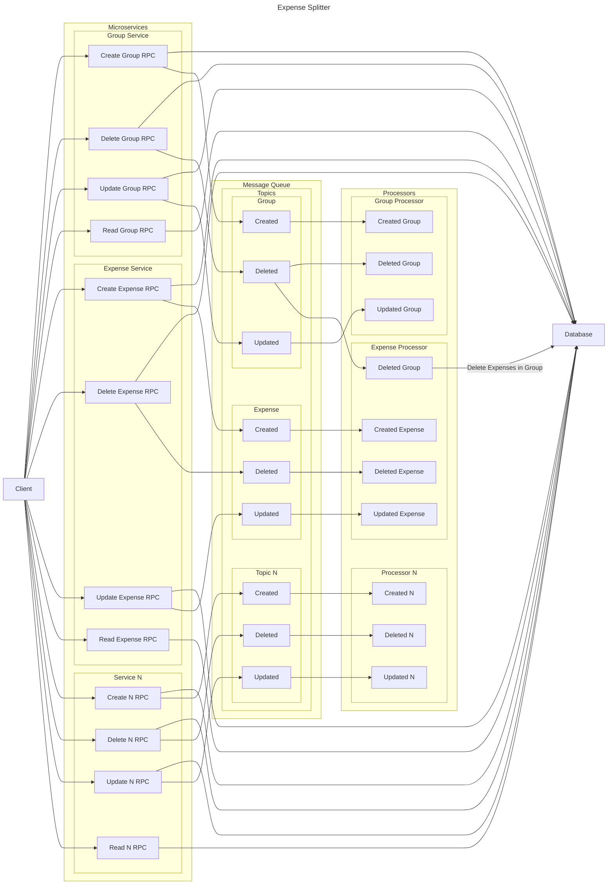

# Expense Splitter
Let's act like an expense splitter was among the use cases with one of the heaviest loads one can imagine. To handle such heavy loads it needs to be scalable. Kubernetes is a framework for running such applications.
This project is an app allowing to split expenses inside a group, i.e. an expense splitter. This simple use case acts as a demo for building a whole solution with several different tools allowing for a convenient operation of distributed computing.
Basically, it provides a frontend for splitting expenses in groups as well as services that perform the actions requested by the user. There are services for each resource type the API exposes and some additional services for the purpose of UX (e.g. gRPC reflection). In contrast to processors, which perform follow-up tasks, services handle the direct requests by the users, i.e.
- reading requests collect the data the user requests and return the results
- writing requests only perform an initial write action and add an event to the the message queue allowing for further write operations
- tasks on the message queue (all but those causing only read operations) are processed by dedicated MQ processing containers for each resource type that requires this kind of event processing
- the message queue tells reading RPCs of the respective services that a resource has changed or was added so that streaming endpoints can send event-driven updates to the clients

## Architecture

## Prerequisites
- You are expected to have the go commandline tool installed
- You are expected to have Docker installed
- You are expected to have a K8s cluster up and running (for development purposes kind is recommended which can be installed using the respective make target)

## Deployment
You can use `make skaffold-run` to run a pipeline that builds and deploys the Helm charts according to your configuration. However, even though this is a hobby project it is recommended to apply a GitOps approach if it is deployed productively. Many of the components in the skaffold pipeline can be reused by other applications, e.g. it is not recommended to use NATS or the IdP for the expense splitter only but also for other applications.

## Development
For dev purposes you can run `make skaffold-dev`. If you only want to develop specific charts but want to have some of the others installed it is recommended to first install charts you rely on using `make skaffold-run` in combination with environment variables set that skip those parts you want to develop later. Then, invert the values of the environment variables responsible for skipping charts so that only those charts will be included that you want to develop. Finally, run `make skaffold-dev` to actually start development.

### General notes
- Dockerfiles are expected to have the repository root as their context
- Skaffold environment variables can be set by creating a `skaffold.env` file (a sample `skaffold.env.dist` is provided)
- the code is written in a way that aims to rely on only few database-specific features so that replacing the underlying database by another becomes easy

### Adding a service
- define the API in `proto/service/<your-service>`
- add the service to the `charts/ha-expense-splitter/values.yaml`
- add the service as Make target to the `Makefile`
- add the service to the `skaffold.yaml` (build image and register the image in the helm chart)
- add the service logic entry point to a new file under `cmd/service/<your-service>/main.go`

### Adding a processor
- define the API in `proto/processor/<your-processor>`
- add the processor to the `charts/ha-expense-splitter/values.yaml`
- add the processor as Make target to the `Makefile`
- add the processor to the `skaffold.yaml` (build image and register the image in the helm chart)
- add the processor logic entry point to a new file under `cmd/processor/<your-processor>/main.go`

## Roadmap
Some elemental features that are intended to be implemented in the near future include:
- user input feedback in frontend
- export protoc artefacts as libraries to registries in a pipeline
- host API documentation
- generate /cmd/*.Dockerfile.dockerignore files from root .dockerignore or find another way to extend the root .dockerignore (background for the current, weird structure: https://github.com/moby/moby/issues/12886)
- auth (probably via Ory Stack in combination with CockroachDB for persistence)
- caching layer for requests against external APIs (e.g. currency API)